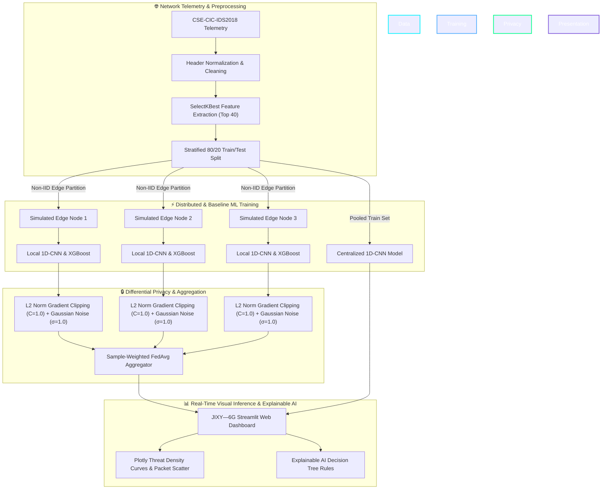

# 🛡️ JIXY—6G: AI-Powered Intrusion Detection & Differential Privacy Preservation

> **Next-Generation Zero-Trust Security Framework for Heterogeneous 6G Network Environments**  
> *Evaluated on 80-Feature CSE-CIC-IDS2018 Network Flow Telemetry Benchmark*

---

## 🌟 Visual System Architecture



---

## 📌 Interactive Deliverable Manifest

Quick links to project repository documents and visual manifests:

- 🗺️ **[Synopsis Implementation Roadmap](roadmap.html)**: Interactive step-by-step roadmap showing how all 6 synopsis milestones were completed.
- 📊 **[Telemetry & Dataset Ingestion Manifest](datasets.html)**: Visual breakdown of CSE-CIC-IDS2018 schema, 80 extracted features, and sample test files.
- 📄 **[Final Synopsis Word Report](Final%20Synopsis%20Report%20(Major).docx)**: Complete academic report document with problem statements, literature review, and objectives.
- 📁 **[Sample Test CSV Directory](data/processed/sample_test_csvs)**: Directory containing 7 pre-packaged threat and benign telemetry CSV files ready for live inference upload.
- 🔬 **[Selected Features Manifest](models/selected_features.json)**: JSON artifact recording top 40 selected feature names.
- 🧠 **[Explainable AI Rules & Importance Weights](models/explainable_logic.json)**: Decision tree IF-THEN rules and feature importance weights.

---

## ✨ Executive Summary & Key Highlights

**JIXY—6G** is a privacy-aware, distributed intrusion detection system (IDS) prototype engineered for future 6G network architectures. By combining **1D Convolutional Neural Networks (1D-CNN)**, **Gradient Boosted Decision Trees (XGBoost)**, **Federated Learning (FedAvg)**, and **Differential Privacy (L2-Norm Gradient Clipping + Gaussian Noise)**, JIXY—6G empowers edge nodes to collaboratively train threat models without ever exposing raw telemetry or user data.

### Highlights:
- 🔒 **Zero-Trust Edge Data Isolation**: Edge nodes perform training locally. Raw client network flows never leave the local environment.
- 🛡️ **Differential Privacy (DP)**: Protects model updates against inversion attacks using L2-norm clipping ($C=1.0$) and Gaussian noise perturbation ($\sigma=1.0$).
- 🧠 **Explainable AI (XGBoost & Decision Tree Reasoning)**: Provides 96.56% classification accuracy and outputs human-readable IF-THEN decision tree rules explaining *why* traffic was flagged.
- 📊 **Real-Time Interactive Dashboard**: Built with Streamlit and Plotly, featuring a minimalist HBO-style loading screen, threat density histograms, pie ratio charts, and packet-rate scatter plots.
- 📁 **Pre-Packaged Test CSV Suite**: Includes 7 ready-to-upload network flow CSV files representing DDoS, Botnets, PortScans, Multi-Vector attacks, and Benign 4K/8K Video streams.

---

## 🚀 Quick Start & Installation Guide

### 1. System Requirements
- **Operating System**: Windows 10/11, macOS, or Linux
- **Python Version**: Python 3.11 or Python 3.12 (64-bit)

### 2. Environment Setup (Windows PowerShell)

```powershell
# Clone repository and enter workspace
git clone <your-repository-url>
cd "AI POWERED INTRUSION DETECTION AND PRIVACY RESERVATION IN 6G NETWORKS/AI POWERED INTRUSION DETECTION AND PRIVACY RESERVATION IN 6G NETWORKS"

# Create virtual environment
py -3.12 -m venv venv

# Activate virtual environment
.\venv\Scripts\Activate.ps1

# Upgrade pip and install dependencies
py -3.12 -m pip install --upgrade pip
py -3.12 -m pip install -r requirements.txt
```

---

## ⚡ Running the Complete Project Pipeline

You can run the full machine learning training and evaluation pipeline using PowerShell:

```powershell
# Step 1: Preprocess Benchmark Dataset & Extract Top Features
$env:PYTHONPATH="."; py -3.12 scripts/preprocess.py

# Step 2: Train Centralized 1D-CNN Baseline Model
$env:PYTHONPATH="."; py -3.12 scripts/train_centralized.py

# Step 3: Train Federated Learning Model (FedAvg across 3 Edge Clients)
$env:PYTHONPATH="."; py -3.12 scripts/train_federated.py --clients 3 --rounds 5 --no-dp

# Step 4: Train Federated Learning Model with Differential Privacy (DP-FL)
$env:PYTHONPATH="."; py -3.12 scripts/train_federated.py --clients 3 --rounds 5 --dp

# Step 5: Train Explainable AI Model (XGBoost & Decision Tree Rules)
$env:PYTHONPATH="."; py -3.12 scripts/train_explainable.py

# Step 6: Generate Performance Comparison Matrix & Evaluation Plots
$env:PYTHONPATH="."; py -3.12 scripts/evaluate.py
```

---

## 🖥️ Launching the Web Dashboard

To launch the **JIXY—6G Interactive Security Dashboard**:

```powershell
py -3.12 -m streamlit run app.py
```

Open your browser and navigate to: **[http://localhost:8501](http://localhost:8501)**

---

## 🧪 Testing Live Threat Detection (Demo Instructions)

1. Open the dashboard at **[http://localhost:8501](http://localhost:8501)**.
2. Navigate to the **`🛡️ Threat Inference Engine`** tab.
3. Click **Browse Files** and upload any sample from **[data/processed/sample_test_csvs](data/processed/sample_test_csvs)**:
   - 📄 **`ddos_attack_threat_sample.csv`** → *DDoS Attack Burst (100% Threat Risk Detected)*
   - 📄 **`botnet_infected_node_sample.csv`** → *Botnet C2 Telemetry (ATTACK Flagged)*
   - 📄 **`portscan_reconnaissance_sample.csv`** → *Port Scan Activity (ATTACK Flagged)*
   - 📄 **`6g_hd_video_stream_benign.csv`** → *Benign 4K Video Flow (0% Threat Risk)*
   - 📄 **`mixed_network_telemetry_sample.csv`** → *50/50 Mixed Traffic Flow*
4. View the live threat summary metric cards, interactive classification donut charts, probability density curves, and packet rate scatter graphs!

---

## 📂 Project Structure & Relative Repository Links

```text
├── app.py                         # JIXY-6G Streamlit Web Application
├── config.yaml                    # System Hyperparameters (Seed, DP clip, FL rounds)
├── requirements.txt               # Python Dependencies
├── datasets.html                  # Visual Manifest of Datasets & Ingestion Pipeline
├── roadmap.html                   # Synopsis Implementation Roadmap Webpage
├── data/
│   ├── raw/                       # CSE-CIC-IDS2018 Benchmark CSV Datasets
│   └── processed/
│       ├── dataset.npz            # Stratified Train/Test NumPy Arrays
│       └── sample_test_csvs/      # 7 Ready-to-upload Demo Test CSVs
├── models/
│   ├── xgboost_model.joblib       # Explainable GBDT Model (96.56% Acc)
│   ├── centralized_model.keras    # Centralized Baseline 1D-CNN Model
│   ├── federated_model.keras      # Standard FedAvg Model
│   ├── federated_dp_model.keras   # Differential Privacy FedAvg Model
│   ├── preprocessor.joblib        # Train-fitted Scaler & Imputer
│   ├── selected_features.json     # SelectKBest Top 40 Features
│   └── explainable_logic.json     # Feature Importances & Decision Tree Rules
├── scripts/                       # Modular Execution Entrypoints
│   ├── preprocess.py              # Data Ingestion & Cleaning
│   ├── train_centralized.py       # Baseline Training
│   ├── train_federated.py         # Simulated FL & DP-FL Training
│   ├── train_explainable.py       # XGBoost & Tree Rule Extraction
│   ├── evaluate.py                # Metric Matrix & ROC Curve Generator
│   ├── generate_test_csvs.py      # Base Test CSV Generator
│   └── generate_more_test_csvs.py # Specialized Threat CSV Generator
└── src/                           # Core Machine Learning Framework Modules
    ├── data/                      # Ingestion & Feature Selector
    ├── models/                    # 1D-CNN Keras Model Builder
    ├── federated/                 # FedAvg Aggregator & Client Sim
    ├── privacy/                   # Differential Privacy Clipping/Noise
    ├── evaluation/                # Performance Metrics & Plotters
    └── prediction/                # CSV Threat Inference Engine
```
